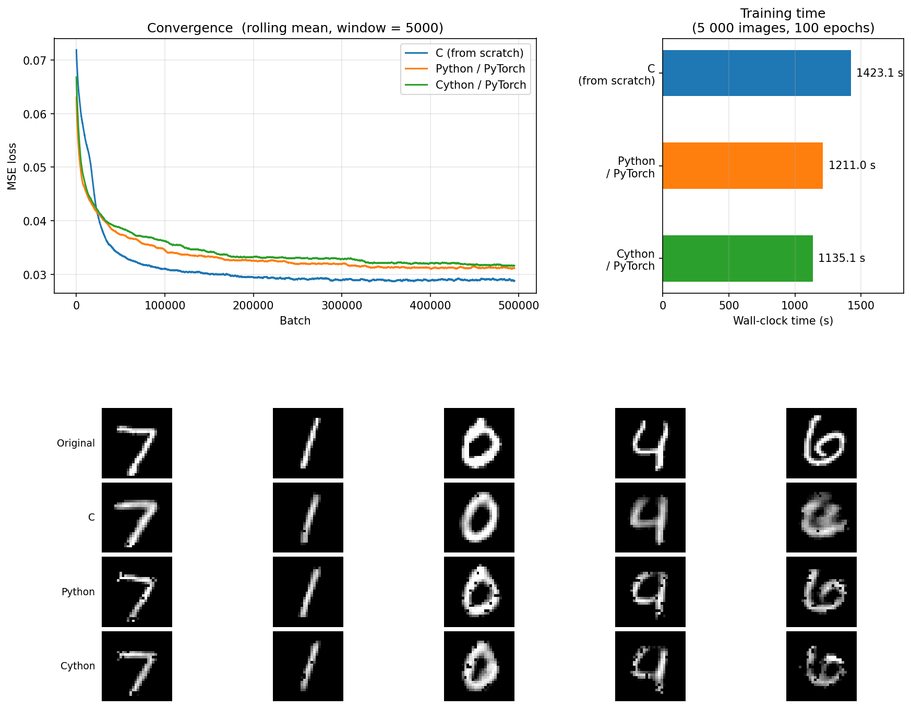

# Autoencoder from Scratch

A dense autoencoder trained on MNIST, implemented in three languages: plain **C**, **Python/PyTorch**, and **Cython/PyTorch**. All share the same architecture, hyperparameters, and Adam optimiser so the comparison is fair.

## Architecture

```
784 → 512 → 128 → 16 → 128 → 512 → 784
```

All activations are ReLU. The bottleneck compresses each 28×28 image down to 16 values. Loss is pixel-wise mean-squared error (matches `nn.MSELoss(reduction='mean')`).

## Results

| Implementation   | Wall-clock | Avg MSE loss |
|------------------|-----------|-------------|
| C (from scratch) | ~12–15 s  | ~0.07       |
| Python / PyTorch | ~13–16 s  | ~0.06       |
| Cython / PyTorch | ~9–15 s   | ~0.06       |

_Benchmarked on 5 000 training images, 1 epoch, batch size 1._  
_C uses OpenBLAS (`cblas_dgemm`) for matrix multiply and OpenMP (8 threads) for Adam weight updates._



## Implementations

### C (`C/`)

Written entirely from scratch — no ML framework.

- **Matrix layout**: flat row-major `double *data` block for cache locality; `double **entries` row-pointer array for ergonomic indexing.
- **BLAS**: OpenBLAS `cblas_dgemm` replaces the hand-rolled matrix multiply.
- **Adam**: bias-corrected (`lr_t = lr × √(1−β₂ᵗ) / (1−β₁ᵗ)`) with a single in-place flat loop — no temporary matrix allocations during parameter updates.
- **Parallelism**: OpenMP `#pragma omp parallel for` on weight-matrix Adam steps (threshold: >2048 elements); thread count set in `config.h`.
- **Weight init**: Ziggurat algorithm for normal-distributed values.

All hyperparameters live in [`C/config.h`](C/config.h) — no other source file needs to be touched to change architecture or learning rate.

### Python (`Python/autoencoder.py`)

PyTorch reference implementation. Serves as the correctness and speed baseline.

### Cython (`Cython/autoencoder.pyx`)

Same PyTorch model as Python with Cython type annotations on loop variables and scalar accumulators to reduce interpreter overhead in the training loop. PyTorch tensor ops dominate at runtime so the gain is modest.

## Setup

```bash
# 1. Download MNIST data (CSV format)
bash C/download.sh

# 2. Create virtual environment and install Python dependencies
python -m venv .venv
source .venv/bin/activate
pip install -r requirements.txt
```

## Running

### All three implementations + generate plots
```bash
source .venv/bin/activate
python plot.py                  # 1 epoch (quick sanity check)
python plot.py --epochs 100     # 100 epochs (better reconstructions, ~70 min)
```

Outputs `plots/results.png` — convergence curves, wall-clock bar chart, and
side-by-side reconstructions from all three implementations.

### Timing comparison only (no plots)
```bash
bash compare.sh
```

### Individual implementations
```bash
# C
cd C && make && ./main                      # 1 epoch (AE_EPOCHS in config.h)
cd C && make && ./main --epochs 100         # override at runtime

# Python / PyTorch
python Python/autoencoder.py

# Cython / PyTorch
cd Cython
python setup.py build_ext --inplace
python run_cython.py
```

## References

- C implementation forked from [mnist-from-scratch](https://github.com/markkraay/mnist-from-scratch) by Mark Kraay
- Normal distribution generator: [Ziggurat inline C](https://people.sc.fsu.edu/~jburkardt/cpp_src/ziggurat_inline/ziggurat_inline.html)
- PyTorch autoencoder: [Implementing an Autoencoder in PyTorch](https://medium.com/pytorch/implementing-an-autoencoder-in-pytorch-19baa22647d1)
